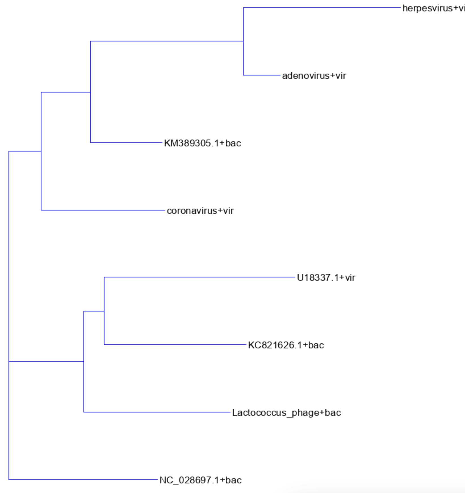
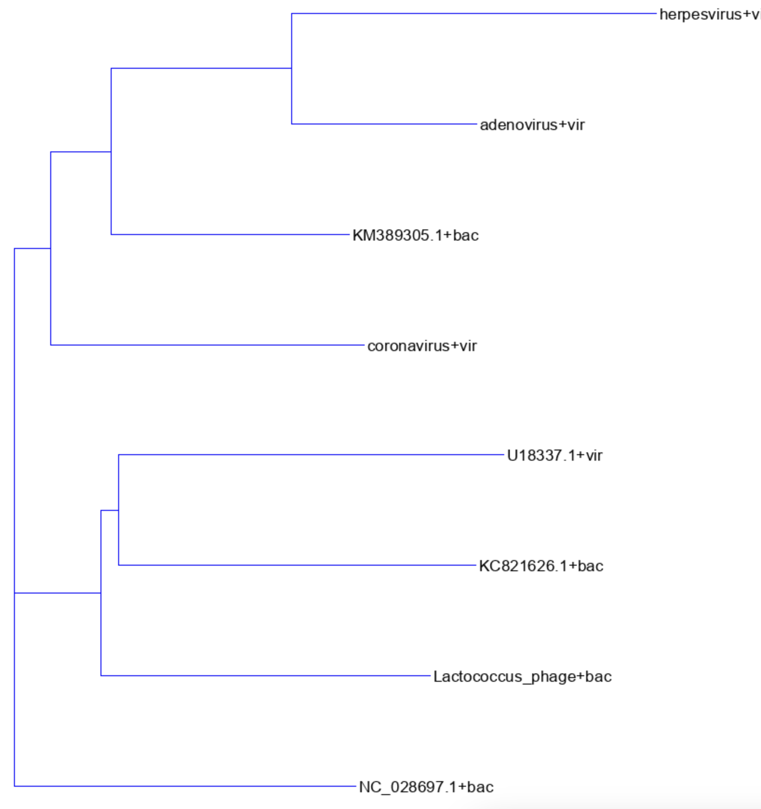

<!-- pandoc -f markdown+lists_without_preceding_blankline -V geometry:margin=1in ataskaita.md --pdf-engine=xelatex -o a.pdf -->

## Atstumo funkcija

Atstumo funkcijai parinkau euklido atstumą, t.y. 

$$ d(\boldsymbol{p}, \boldsymbol{q}) = \sqrt{\sum_{i=1}^{n} (q_i - p_i)^2} $$

(kur n yra 7 - kodono, ir 400 - dikodono atvėju)

šia operacija atitinka `scipy` bibliotekos `pdist` funkcija. Ji gražina masyvą vektoriu, tai poto naudojant `squareform` paverčiam į atstumo matricos formą.

## Kodonų ir Dikodonų medžiai

Gauti kodonų ir dikodonų medžiai pagal klusterizavimasi atrodė įdentiškai (tačiau atstumų matricų vertės ne vienodos!). Žr. Figure 1 bei Figure 2 dokumento apačioje.

## Dažniai, klasterizavimas

### Ar skiriasi kodonų ir dikodonų dažnis tarp žinduolių ir bakterijų virusų?

Taip, kodonų ir dikodonų dažniai skiriasi. Tai matosi iš to, kad atstumai tarp bakterijų ir žinduolių virusų yra didesni, negu jų grupėse (t.y. bakterijos vs bakterijos atstumas bendru atvėjų mažesnis negu bakterija vs virusas, ir atsvirkščiai).

### Kaip klasterizuojasi virusai?

Bendru atvėju, virusai klasterizuojasi pagal jiem priklausančia kategorija (t.y. bakterijų su bakterijų, žinduolių su žinduolių).

### Gal kažkuris virusas labai išsiskyrė?

Išsiskyrė virusas U18337.1 (`mamalian3.fasta`), kadangi jis klasterizavosi arčiau bakterinių, vietoj žinduolinių (buvo arčiau 3/4 bakterinių negu su likusiais žinduolių).

### Kokie kodonai/dikodonai labiausiai varijuoja?

Didžiausia variacija buvo tarp herpesvirus (`mamalian4.fasta`) ir U183371 (`mamalian3.fasta`). Kodonų matricoje atstumas buvo 0.124, dikodonų matricoje atstumas buvo 0.048.