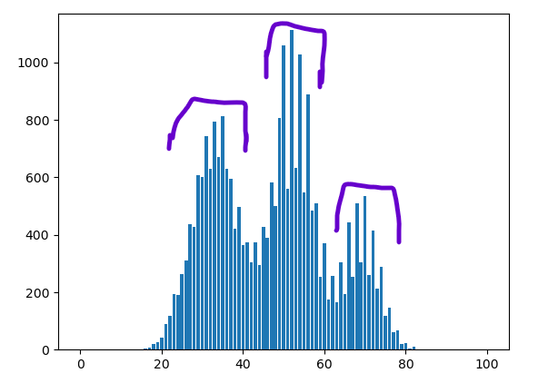

<!-- pandoc ataskaita.md -V geometry:margin=1in -f markdown-implicit_figures -o ataskaita.pdf -->

# FASTQ Formatas

FASTQ formato įpatybės:

* FASTQ seka apibudina 4 viena po kitos einančios linijos:

  * Pirmas laukas/linija prasideda su '@' simboliu, toliau eina sekos ID ir (nebutinu) pavadinimu/apibudinimu

  * Antras laukas/linija yra sekos duomenys

  * Trecias laukas/linija prasideda su '+' simboliu, ir (nebutinu) tuo pačiu sekos ID iš pirmo lauko bei pavadinimu/apibudinimu

  * Ketvirtas laukas/linija nusako sekos duomenų (antrame lauke) kokybės vertes, ir privalo turėt tiek pat simboliu kiek antas laukas. Simbolis nusakantis kokybę eina nuo 0x21 ('!', žemiausia kokybė) iki 0x7E ('~', aukščiausia kokybė)

Skirtumai nuo FASTA:

* FASTA atvėju, viena seką aprašyta dviejomis linijomis (linija prasidedanti su ">" yra sekos pavadinimas/apibudinimas, sekanti linija turi sekos duomenis)

* FASTA neturi sekos kokybės vertės saugojimo

# Mėnesio diena

Gimiau 05d. 33 + 5 - 38. Ascii simbolis - '&'

# ASCII kodų pradžia nuo 32

Viskas prieš 33 yra 'nematomi' simboliai, kurie turi specialia reikšmę. 33 simbolis - '!' - lengvai matomas (32 simbolis - tarpas ' ' dar gal irgi teoriškai tiktų, bet gali būt sunku jį pamatyt)

# Skriptas

a) "Sanger Phred+33" arba "Illumina 1.8+ Phred+33" - tiksliai pasakyt neimanoma be papildomos informacijos. Nustatyti koduote internete suradau informacija apie kokie yra min & max kokybės vertės kiekvienam kodavimui, tada pateiktam failui apskaičiavau min max aptiktas naudotas vertes. Pagal tai liko tik prieš tai du minėti galimi variantai. Dėja max vertė kuria aptikom failuose - 73. "Sanger Phred+33" viršutinis rėžys yra 73, tai teoriškai didesnis šansas kad šitas tiks, bet kadangi "Illumina 1.8 Phred+33" viršutinis rėžys yra 74 (labai artimas), tai su 100% užtikrintumu neįmanoma sakyt.

b) Nupieštame grafike matosi kad nukleotidų G, C read % susidaro 3 stambūs pikai.

c) Lentelė su read id's ir bakterijų rūšymis

| ID                                           | Bacteria                                                                                                   |
|----------------------------------------------|------------------------------------------------------------------------------------------------------------|
| M00827:12:000000000-AEUNW:1:1109:10717:22903 | gi\|2811882222\|gb\|CP170274.1\| Staphylococcus aureus strain CUVET16-L3.1 chromosome                      |
| M00827:12:000000000-AEUNW:1:1110:14974:17314 | gi\|2811882222\|gb\|CP170274.1\| Staphylococcus aureus strain CUVET16-L3.1 chromosome                      |
| M00827:12:000000000-AEUNW:1:2107:26207:19368 | gi\|2811882222\|gb\|CP170274.1\| Staphylococcus aureus strain CUVET16-L3.1 chromosome                      |
| M00827:12:000000000-AEUNW:1:1113:25416:11386 | gi\|2811882222\|gb\|CP170274.1\| Staphylococcus aureus strain CUVET16-L3.1 chromosome                      |
| M00827:12:000000000-AEUNW:1:2107:25323:17570 | gi\|2811884867\|gb\|CP170285.1\| Staphylococcus aureus strain CUVET17-Y1.3 chromosome                      |
| M00827:12:000000000-AEUNW:1:2102:21638:6428  | gi\|2804431113\|gb\|CP169294.1\| Escherichia coli strain MG1655-pvir chromosome, complete genome           |
| M00827:12:000000000-AEUNW:1:1112:13519:27519 | gi\|2852409634\|emb\|OZ040446.1\| Escherichia coli isolate 30859_5#309 genome assembly, chromosome: 1      |
| M00827:12:000000000-AEUNW:1:1114:9338:21481  | gi\|2853641462\|gb\|CP173573.1\| Escherichia coli strain 98197 chromosome, complete genome                 |
| M00827:12:000000000-AEUNW:1:2102:26654:16721 | gi\|2853732800\|gb\|CP173497.1\| Escherichia coli strain 98217 plasmid p98217-contig_2                     |
| M00827:12:000000000-AEUNW:1:1107:22777:4094  | gi\|2852409372\|emb\|OZ039351.1\| Escherichia coli isolate 30134_6#342 genome assembly, chromosome: 1      |
| M00827:12:000000000-AEUNW:1:2101:25763:9119  | gi\|2432789391\|dbj\|AP025540.1\| Thermus thermophilus HB8_001 DNA, complete genome                        |
| M00827:12:000000000-AEUNW:1:2104:7421:7535   | gi\|2701839450\|dbj\|AP031334.1\| Thermus thermophilus TF28 DNA, complete genome                           |
| M00827:12:000000000-AEUNW:1:2109:4865:8817   | gi\|2432791350\|dbj\|AP025541.1\| Thermus thermophilus HB8_001 plasmid pHB8b DNA, complete sequence        |
| M00827:12:000000000-AEUNW:1:2106:10502:2923  | gi\|2676241087\|gb\|CP144687.1\| Thermus thermophilus strain TTHB27_delta_cmr4 chromosome, complete genome |
| M00827:12:000000000-AEUNW:1:2113:13880:11358 | gi\|2432789391\|dbj\|AP025540.1\| Thermus thermophilus HB8_001 DNA, complete genome                        |

# Bakteriju rušys:
Mėginyje aptikau: "Staphylococcus aureus", "Escherichia coli", "Thermus thermophilus"